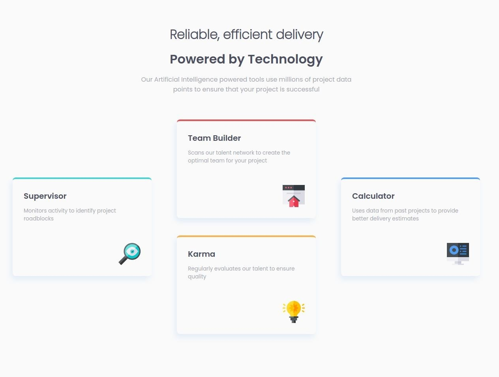
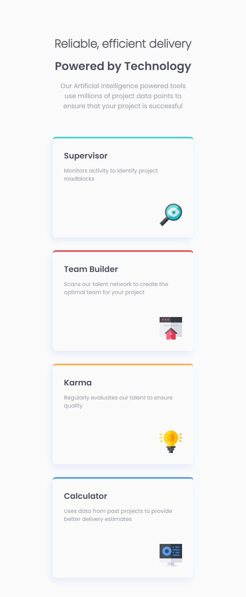

# Frontend Mentor - Four card feature section solution

This is a solution to the [Four card feature section challenge on Frontend Mentor](https://www.frontendmentor.io/challenges/four-card-feature-section-weK1eFYK). Frontend Mentor challenges help you improve your coding skills by building realistic projects. 

## Overview

### The challenge

Users should be able to:

- View the optimal layout for the site depending on their device's screen size

### Screenshot

### Links

- Solution URL: [Four Card Feature Section](https://www.frontendmentor.io/solutions/four-card-section-with-css-grid-97GdvDvy4w)
- Live Site URL: [Four Card Feature Section](https://fm-four-card-feature-section-master-two.vercel.app/)

## My process

### Built with

- Semantic HTML5 markup
- CSS custom properties
- Flexbox
- CSS Grid

### What I learned

Flexiable content box managemnet.

## Author

- Frontend Mentor - [@ShadhinForever](https://www.frontendmentor.io/profile/ShadhinForever)
- Github - [@ShadhinForever](https://www.twitter.com/ShadhinForever)
